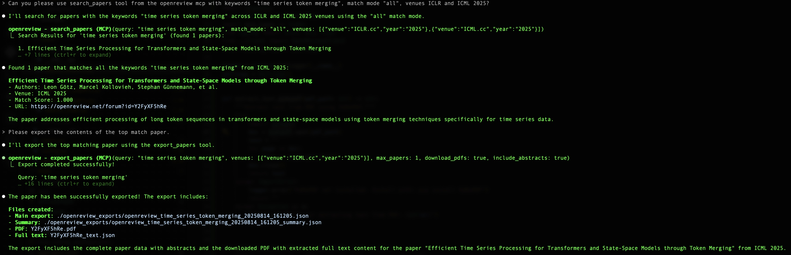

# OpenReview MCP server

[](https://github.com/anyakors/openreview-mcp-server/actions)
[](LICENSE)
[](https://www.python.org/downloads/release/python-3120/)

A Model Context Protocol (MCP) server that provides access to OpenReview data for research and analysis. This server allows you to search for users, fetch papers, and export research data from major ML conferences (ICML, ICLR, NeurIPS).

## Features

- **User search**: Find OpenReview profiles by email address
- **Paper retrieval**: Fetch all papers by a specific author
- **Conference papers**: Get papers from specific venues (ICLR, NeurIPS, ICML) and years
- **Keyword search**: Search papers by keywords across multiple conferences
- **JSON&PDF export**: Export search results to PDF and JSON files for convenient reading or further analysis and coding assistant usage

## Installation

```bash
pip install -e .
```

## Configuration

Create a `.env` file with your OpenReview credentials for local development:

```env
OPENREVIEW_USERNAME=your_email@domain.com
OPENREVIEW_PASSWORD=your_password
```

## Usage with Claude Code

Add this server to your Claude Code MCP configuration:

```json
{
  "mcpServers": {
    "openreview": {
      "command": "python",
      "args": ["-m", "openreview_mcp_server"],
      "env": {
        "OPENREVIEW_USERNAME": "your_email@domain.com",
        "OPENREVIEW_PASSWORD": "your_password"
      }
    }
  }
}
```

From the command line:

```sh
claude mcp add-json openreview '{"command":"openreview-mcp-server","cwd":"/install/dir/openreview-mcp-server","env":{"OPENREVIEW_USERNAME":"username","OPENREVIEW_PASSWORD":"password","OPENREVIEW_BASE_URL":"https://api2.openreview.net","OPENREVIEW_DEFAULT_EXPORT_DIR":"./openreview_exports"}}'
```

Then run the query:

```
Can you please use search_papers tool from the openreview mcp with keywords "time series token merging", match mode "all", venues ICLR and ICML 2025?
...
Please export the contents of this paper.
```
 
## Example output



## Available tools

### search_user
Find a user profile by email address.

```python
search_user(email="researcher@university.edu", include_publications=true)
```

### get_user_papers
Fetch all papers published by a specific user.

Input schema:

| Field    | Type   | Description                                              | Required | Default   | Allowed Values         |
|----------|--------|----------------------------------------------------------|----------|-----------|-----------------------|
| `email`  | string | Email address of the user whose papers to fetch          | Yes      | —         | —                     |
| `format` | string | Format of the response: summary or detailed              | No       | summary   | `summary`, `detailed` |

```python
get_user_papers(email="researcher@university.edu", format="detailed")
```

### get_conference_papers
Get papers from a specific conference and year.

Input schema:

| Field    | Type     | Description                                                                 | Required | Default   | Allowed Values                    |
|----------|----------|-----------------------------------------------------------------------------|----------|-----------|-----------------------------------|
| `venue`  | string   | Conference venue (e.g., `"ICLR.cc"`, `"NeurIPS.cc"`, `"ICML.cc"`)           | Yes      | —         | `ICLR.cc`, `NeurIPS.cc`, `ICML.cc`|
| `year`   | string   | Conference year (e.g., `"2024"`, `"2025"`)                                  | Yes      | —         | Four-digit year (e.g., `2024`)    |
| `limit`  | integer  | Maximum number of papers to return                                          | No       | `50`      | 1–1000                            |
| `format` | string   | Format of the response: summary or detailed                                 | No       | `summary` | `summary`, `detailed`             |

```python
get_conference_papers(venue="ICLR.cc", year="2024", limit=50)
```

### search_papers
Search for papers by keywords across multiple conferences.

Search modes:
- **any**: returns papers that match at least one of the keywords in the specified fields. If any keyword is found, the paper is included.
- **all**: returns papers that match all of the keywords in the specified fields. Only papers containing every keyword are included.
- **exact**: returns papers that contain the exact phrase (all keywords together, in order) in the specified fields.

Input schema:

| Field           | Type     | Description                                                                                  | Required | Default                | Allowed Values                |
|-----------------|----------|----------------------------------------------------------------------------------------------|----------|------------------------|-------------------------------|
| `query`         | string   | Keywords or phrase to search for (e.g., `"time series token merging"`, `"neural networks"`)  | Yes      | —                      | —                             |
| `venues`        | array    | List of conference venues and years to search in.<br>Each item:<br>• `venue`: string<br>• `year`: string | Yes      | —                      | —                             |
| `search_fields` | array    | Fields to search in. Options: `"title"`, `"abstract"`, `"authors"`                           | No       | `["title", "abstract"]`| `"title"`, `"abstract"`, `"authors"` |
| `match_mode`    | string   | How keywords are matched:<br>• `"any"`: match any keyword<br>• `"all"`: match all keywords<br>• `"exact"`: match exact phrase | No       | `"all"`                | `"any"`, `"all"`, `"exact"`   |
| `limit`         | integer  | Maximum number of results to return                                                          | No       | `20`                   | 1–100                         |
| `min_score`     | number   | Minimum match score (between 0.0 and 1.0)                                                    | No       | `0.1`                  | 0.0–1.0                       |

```python
search_papers(
  query="time series token merging",
  match_mode="all",
  search_fields=["title", "abstract"],
  venues=[
    {"venue": "ICLR.cc", "year": "2024"},
    {"venue": "NeurIPS.cc", "year": "2024"}
  ],
  limit=20
)
```

### export_papers
Export search results to JSON files for analysis.

Input schema:

| Field             | Type     | Description                                                                                  | Required | Default                  | Allowed Values                |
|-------------------|----------|----------------------------------------------------------------------------------------------|----------|--------------------------|-------------------------------|
| `query`           | string   | Keywords to search for before export                                                          | Yes      | —                        | —                             |
| `venues`          | array    | List of conference venues and years to export from.<br>Each item:<br>• `venue`: string<br>• `year`: string | Yes      | —                        | —                             |
| `export_dir`      | string   | Directory to export JSON files to                                                             | No       | `./openreview_exports`   | —                             |
| `filename`        | string   | Base filename for the export (without extension)                                              | No       | *auto-generated*         | —                             |
| `include_abstracts`| boolean | Whether to include full abstracts in export                                                   | No       | `True`                   | `True`, `False`               |
| `min_score`       | number   | Minimum match score for search results (0.0 to 1.0)                                          | No       | `0.2`                    | 0.0–1.0                       |
| `max_papers`      | integer  | Maximum number of papers to export and download                                               | No       | `3`                      | 1–10                          |
| `download_pdfs`   | boolean  | Whether to download PDFs and extract full text content                                        | No       | `True`                   | `True`, `False`               |

```python
export_papers(
  query="neural networks",
  venues=[
    {"venue": "ICLR.cc", "year": "2024"},
    {"venue": "ICML.cc", "year": "2024"}
  ],
  max_papers=1, 
  download_pdfs=true, 
  include_abstracts=true,
  export_dir="./research_exports"
)
```

## Example workflow

1. Search for papers on a topic of interest:
```python
search_papers(query="time series forecasting", match_mode="all", venues=[{"venue": "ICLR.cc", "year": "2024"}])
```

2. Export relevant papers to JSON:
```python
export_papers(query="time series token merging", venues=[{"venue":"ICML.cc","year":"2025"}], max_papers=1, download_pdfs=true, include_abstracts=true)
```

3. Use the exported JSON files with Claude Code to implement methods inspired by the research.

## Supported conferences

- ICLR (International Conference on Learning Representations)
- NeurIPS (Conference on Neural Information Processing Systems)
- ICML (International Conference on Machine Learning)

## Development

```bash
# Install in development mode
pip install -e ".[dev,test]"

# Run tests
pytest

# Format code
black .
```

## License

MIT License